# Mission Ingenuity

- **Jiaming Shen**, Github ID: [JohnnieShen](https://github.com/JohnnieShen)
- **Liam Baca**, Github ID: [Racecar13](https://github.com/Racecar13)
- **Jay Kim**, Github ID: [jaykim2022](https://github.com/jaykim2022)

## Game Summary

You are a command module of a defunct rover and you found yourself powering on in the middle of nowhere on an alien planet with no parts attached to you. You need to scavenge for parts scattered around and upgrade your rover, fight hostile enemies of various kinds and build a rocket that will get you out of here to continue your quest for exploration.

## Genres

This game will be a TPS game with characteristics taken from rogue-lite games. It will also feature a handcrafted openworld that allows the player to explore freely, but the overall game structure will still be linear.

## Inspiration games

**TerraTech**


"TerraTech is an open-world, sandbox adventure game, where you design and build your own creations through a mix of crafting, combat and discovery. Design vehicles from a huge library of blocks. Scavenge, craft and buy new parts to survive and become the ultimate planetary prospector."

We plan to take inspiration from the general gameplay loop of TerraTech, where the player is able to explore an open-ish world and scavenge for new building blocks of their vehicle. However, we plan on having “levels” instead of a big open world so that the project is going to scale a bit better and we could add more mechanics and elements into different levels. We also plan on adding more engaging gameplay other than exploration, for example roguelike mechanics.

**Slay the Spire**

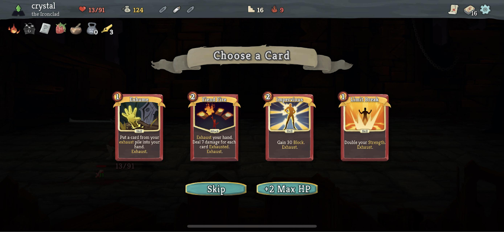

“Slay the Spire is a game in which you climb The Spire, ascending its floors through three acts, encountering many enemies, bosses, and events along the way. The paths through each act all lead to a final floor where a challenging boss encounter awaits. The content of each floor and the available paths through each act are procedurally-generated, so each run will be a different experience.”

We aim to incorporate the roguelite deck-building aspect of Slay the Spire into our game. Rather than having “cards” that players can pick up, our game will offer different parts, weapons, and general customization to the player’s car which can enhance the current build. An overarching goal would be to develop a diverse skill tree in which players can build up their vehicles depending on an archetype they want to follow, with some added randomization. 

## Gameplay

Players will explore an alien planet from a third-person perspective, controlling a modular rover that evolves as they collect new parts. Interaction and game loop will be driven by scavenging, combat, and various upgrades, encouraging experimentation with different builds. 

A customization inventory system will allow players to part swap on the fly, which rewards creativity, while an in-game map provides navigation assistance. 

Control-wise, the game will feature control schemes similar to other arcade-style vehicle driving/third-person shooter games such as *Robocraft*.

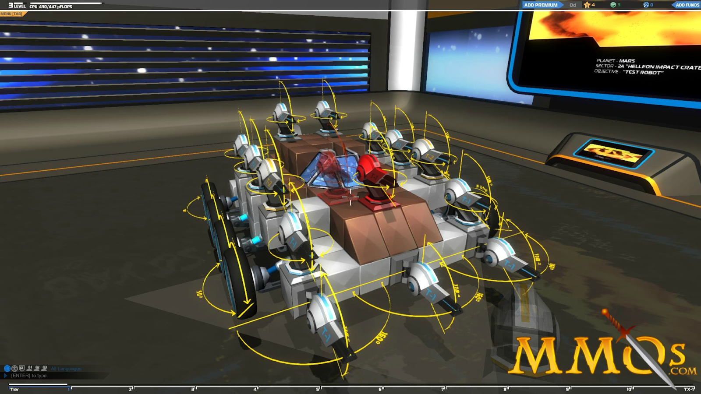

## Development Plan

### Project Checkpoint 1-2: Basic Mechanics and Scripting (Ch 5-9)

~~Sketch out a rough idea of what parts of your game you will implement for the next submission, Project Checkpoint 1-2: Basic Mechanics and Scripting involving Unity textbook Chapters 5 through 9. You will come back to update this for each submission based on which things you've accomplished and which need to be prioritized next. This will help you practice thinking ahead as well as reflecting on the progress you've made throughout the semester.~~

~~Our initial goal will be to implement basic car and tire physics mechanics into our game. One approach to this is treating cars as a single rigid body attached to 4 additional rigid bodies which represent the wheels. The forces will be acting on the wheels, and consist of three major components:~~

1. ~~**Suspension**~~ 
   - ~~Based on classical spring mechanics, with an added damping force to account for an infinite oscillation.~~
   - ~~A basic calculation would be:~~
     ```math
     Force = (Offset × Strength) - (Velocity × Damping)
     ```

2. ~~**Acceleration**~~
   - ~~Depends on the amount of applied torque.~~
   - ~~Depending on the current direction of steering, different acceleration limits will be hit.~~
   - ~~A basic implementation is to set a top speed value, and then based on the applied torque, follow a semi-Gaussian distribution for situational acceleration limits.~~

3. ~~**Steering**~~
   - ~~Two different components to velocity:~~
     - ~~The direction the tires are facing.~~
     - ~~The direction perpendicular to that.~~
   - ~~Steering arises from that perpendicular direction, and in order to provide a sense of traction/steering, a counteracting opposite velocity is needed.~~  
   - ~~Depending on the magnitude of this opposite velocity, the amount of sliding will be adjusted.~~

~~A higher-reaching goal will be to work on a basic implementation for the car-building mechanic.~~

~~Possibly adding in some “parts” that can be added onto the car and a simple UI selection screen for those parts.~~

### Additions

~~There were three main areas we completed that we did not plan on:~~

1. ~~3D models~~
    - ~~Johnny made blender models for each of our parts (hull, command module, turret, wheel)~~
    - ~~We still do not have textures and are just using basic colors which we hope to improve~~
2. ~~Turrets~~
    - ~~We implemented the turret piece which attaches to a block. The turret armature is fully articulated and animated to point towards the player’s cursor. It currently shoots rigidbody bullets before having to reload.~~
3. ~~Mode switching~~
    - ~~We implemented build mode and drive mode as well as different camera controls and transitions for each.~~

### Project Part 2: 3D Scenes and Models (Ch 3+4, 10)

~~For the next submission, we would like to improve on our 3D models by adding textures. This will allow us to make blocks with different strengths or properties in addition to visual differences. We would also want to create more models for the blocks e.g. different cannon designs for different types, shield generator, armor blocks etc. We would also want to create assets for props on the terrain and a better terrain in general.~~

~~We would also want to improve the shooting aspect of the game, for the next milestone, a conservative estimate would be to have a stationary enemy that the player can shoot at and eventually destroy, and a more optimistic estimate would be a primitive enemy AI that would allow some interaction. We would also want to improve the depth of the gunplay by e.g. introducing more damage types (e.g. energy vs ballistic) and an energy shield.~~

~~Game element wise we also want to incorporate a looting game loop where parts will be scattered around and the player has to use a certain block to “vacuum” it up and put it on in the building mode.~~

~~We would also like to work on world generation and 3D models for the environment the player drives around in. Jay has worked on a primitive version of procedural generation of the terrain and we would want to keep working on it and incorporate this into the game. This is tentative as we are unsure whether it would work well performance wise.~~

~~To summarize:~~

- ~~More 3D models, texture and improve terrain~~
- ~~Incorporate the actual asset for the wheel and replace current placeholder asset~~
- ~~Enemy target (Tentative: primitive enemy AI)~~
- ~~Better, more in depth gunplay and shooting mechanics~~
- ~~Looting~~
- ~~Tentative: Procedural generation of terrain~~

### Additions

~~- Visual Effects~~
  ~~- We implemented a shader for achieving a toon-style shading effect, and also a post processing script for highlighting the edges of objects to give the game a more stylized look. We are currently experimenting with the visual designs and may scrap or change this in the future.~~
~~- Better blocks management~~
  ~~- We implemented a connectivity system for checking if a block is still attached to the core, and if not we mark it as fallen off, it is then disabled and the player can pick it up.~~
~~- Arena gamemode~~
  ~~- Since our main game loop is not fleshed out yet, we have implemented an arena game mode, where the player has to fight waves of enemies, upgrade their vehicle and survive the longest. We made this to be a testing ground for tuning the enemy AI and combat feels in general, but this is also fully playable and customizable.~~
~~- Particle Effects~~
  ~~- Working with Unity’s Particle Systems, as well as the Shader and Visual Effects Graphs to bring together a more cohesive and visually appealing shooting system. By adding a muzzle flash / explosion for the base turret as well as a laser gun (in progress) for the energy turret, we aimed to strengthen the visual quality of our game.~~

### Project Part 3: Visual Effects

~~For the next submission, we would like to work more on the level design of the game to make it look more fleshed out. In the main open world game mode, we would like to enlarge the playable area and add more points of interest to promote exploration for the player. We would also like to do a simple implementation of a mission board/checklist and some simple quests to push towards the final goal of having a linear progression in an open world.~~

~~We would also want to keep on implementing more interesting blocks in general. One type of weapon we have started to work out towards the end of this milestone was physics based weapons (e.g. think a wrecking ball), we are yet to work out the quirks of the physics system, but we believe that once we have this implemented we would greatly improve the fun factor of the game. We also want to look into making blocks that work essentially as an addon to the vehicle, which doesn’t do anything directly, but gives the player power ups and bonuses. One example could be an engine block, where all attached wheels get a 20% boost in acceleration.~~

~~For the visual parts, we would want to keep working on the visual design of the game. In the current vision, we plan on making the game low poly and with a cartoonish style. This is kinda there but would require more modeling and tuning of the shaders. We also want to actually start implementing textures into the game as we believe that they would greatly elevate the look.~~

~~Last but not the least, we plan to add more variety to the enemy archetypes. Right now we only have one enemy prefab that we can spawn and it is more of an AI demo more than anything else. We plan on implementing a separate scene as an enemy prefab builder that would finish the configurations on the fly and accelerate the enemy building process.~~ 

- ~~Improve level design, points of interests, quest checklist / tracking system, quests~~ (In the works with nothing to show at this moment)

- ~~More blocks, ~~bug fixes related to physics based damage~~, add-on blocks  (Did more pixel art creation for UI so no time for modeling)~~
~~- Improve visual design, upgrade shaders and textures, flesh out what we want the final design to look (not the imminent focus)~~
- ~~More AI prefabs, AI prefab builder (Tentative: not completely necessary as the normal workflow is not terrible) (Did not do, current implementation completely overhauled vehicle representation and old AI prefabs are not updated to date, and AI script might not work with terrain, might need updating)~~
- ~~Better UI (Tentative)~~

### Additions

- ~~Crafting~~
  -  ~~Implemented menu for crafting blocks, can be entered from build mode. Players can recycle blocks in exchange for scraps, which can be used to craft other blocks, this will be a backup thing for players to acquire blocks, we did this first to flesh out the gameplay loop before worrying about the looks.~~
  - ~~Also implemented a resource manager for handling bullet counting, energy counting, scrap bookkeeping etc.~~
- ~~UI~~
  ~~- Created pixel art for block representations~~
  ~~- Implemented a rough draft of what we want the UI to look like, this is more of a mockup than anything.~~
~~- Block previews for building~~
  ~~- This is an old feature that was disabled because it was really buggy, it is all fixed up and fully functional now.~~
~~- Minimap~~
  ~~- Implemented a first version of the minimap on the UI, currently there are some issues with the full rendering pass. Fixes pending.~~

~~As you can probably see, we put a lot of time into fleshing out the UI for the sake of streamlining the gameplay experience, and the previous plan was changed to some degree. The next checkpoint will be the checkpoint of playability, which will be our main focus from now.~~

~~### Project Part 4: Sound, UI, and Animation~~

~~For the next submission, we plan to work on sound design for our game. In our current state, while the game is visually quite put together, it lacks the background music, ambience, and other miscellaneous sounds to give the game a more lifelike feel. To start out, we plan on including sound effects such as building sounds, collision sounds, driving sounds, and shooting sounds. If time permits, having basic background music may be a desired addition. A good amount of our UI has been fleshed out, but fine tuning the parameters would be ideal. In terms of animation, having simple animations for building/block assembling, possibly shooting, and more. Since our game doesn’t particularly deal with characters, our animations will be less based on traditional rigging and more mechanical to fit with the nature of our game.~~

~~For the next checkpoint as well we plan to have a more developed tutorial level, due to the slight complexity of our build systems to newer users. The goal will be to create a scene that has an abandoned government facility aesthetic, with obstacles, possibly a rogue enemy, and targets to give players a feel of the game’s building, shooting, and movement. We will include a title screen for players to either select the tutorial level if they want a recap on the control, or a play button to deliver them directly to the main gameplay.~~

~~We also plan on improving the playability of the game in general, in our case meaning a bigger map, more AI to kill and structures and POIs to explore.~~ 

- ~~More blocks, add-on blocks~~
- ~~More AI prefabs, AI prefab builder (Tentative: not completely necessary as the normal workflow is not terrible), bring AI system up to date with overhauled vehicle representation~~
- ~~More level design work, tutorial level with corresponding mechanics (out of scope), bigger map in first world, script for spawning in enemies dynamically, more POIs~~
- ~~Sounds (did not get around to do)~~

### Additions:
~~- AI Converter~~
   ~~- Implemented a script to allow for developers to construct vehicles of their own design in the Build Mode, apply the AI converter script, and that prefab can be saved as an AI~~
   ~~- Vastly improved efficiency and usability for creating new enemy types~~
~~- Block Types~~
   ~~- Different rarities for our blocks were added (common, uncommon, rare, epic and legendary) and with each increasing rank, a proportional increase in stats is attached.~~
~~- Terrain Size~~
   ~~- The terrain was modified to be 16x larger than our original (1000x1000 → 4000x4000), Added a couple of structural components, a centralized boss base, and more, Randomized AI spawn on the terrain~~
~~- Main Menu~~
   ~~- Added a start screen with a custom background, buttons for the main gameplay loop, tutorial, settings, and quitting (only main gameplay is interactive at the moment), a menu that follows around the player’s cursor, and then some particle effects to give it extra flair~~
~~- Tree Breaker~~
   ~~- Unity’s terrain tree system doesn’t actually place trees as game objects, which means the player can’t easily interact with them as you would with a traditional game object. First, a script had to be created to where any terrain tree within a certain radius of the player’s vehicle would have an associated tree prefab spawned in. Then, another script had to be added to the tree prefab to allow for the deletion of both the prefab and terrain counterpart when colliding with the player.~~
~~- Bullet/Rocket Booster Effects~~
   ~~- Bullet trails were added for both the standard and energy turret. In addition to changing the bullet projectiles themselves, colors were used to differentiate between the two, orange for original and blue for energy. An added interaction was put into place with the energy shield, where the standard turret bullets will deflect off of energy shields, while the energy bullets will be absorbed.~~
   ~~- A rocket booster was added to make the game feel more alive for the player, the block allows for acceleration when the player presses shift. An associated particle effect was created for it.~~
~~- Boss Fight~~
   ~~- A more advanced AI was created to simulate a boss fight which lives in the boss base, a script was attached to where anytime a player comes within a certain distance, a large health bar will appear towards the top of the screen~~

### Next milestone:

~~For the next milestone, we want to continue fleshing out the core gameplay and adding more content to the game. One thing we are in the middle of doing would be a boss fight of some sorts that will feature a POI and a dark souls style health bar, which we thought would be really funny. Another thing that we would want to do to fully close the gameplay loop would be to create a set of endgame conditions so that players can get out of an level and move on to the other. We are still in the middle of looking into this.~~

~~Content wise, another thing we could do would be to add even more blocks to the game. We have added a system of block rarities to the game as a placeholder system to enrich the gameplay, but we would like to keep on exploring our options. One issue this system brings us is that since now there are about 20 blocks, it is really annoying to look for a specific one. Thus, we would like to implement some QOL fix for this issue next patch and potentially change how the players interact with the system.~~

~~Another thing we've been always wanted to do is to add sounds effects and music to the game. We have been sidetracked for multiple times in attempting to do this, but hopefully we can add it in this patch.~~

- ~~Boss enemies~~ with special scripts for behavior, ~~boss fight mechanic, end game goals (tentative if our time allows), more enemy types~~
- More POI on the map, ~~fell-able trees~~ with particle effects.
- More blocks, ~~better navigation scheme for build mode for selecting blocks~~
- ~~UI polish~~
- ~~Sounds (sound effects, music)~~

### Additions

~~- Completed game loop: We added respawning and an endgame condition to the game. the player would need to attach certain blocks to the vehicle to win the game.~~

### Next milestone

Since we have completed most of the mechanics of the game, we would focus on polishing the gameplay experience and adding more content for the next milestone. 

- More enemy prefabs and randomized spawn. 
- More diverse behavior for enemies
- UI and QOL polishes
- More sound effects

## Development

### Project Part 1

#### Initial Vehicle Building Systems and Physics

Going into this checkpoint, based on our feedback, our main goals were to implement a rudimentary vehicle building system, focusing on core mechanics and systems over polishing. We started out with a primitive block-building system utilizing proxy geometry in place of more-developed assets, inspired by the mechanics of established games such as Minecraft. As per our initial plan, we worked on establishing a more stylized physics system to give the game a more satisfying feel.

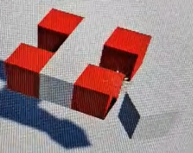

#### Assets

A couple assets were created using the 3D Blender Engine, to add some more detail to our mechanics.

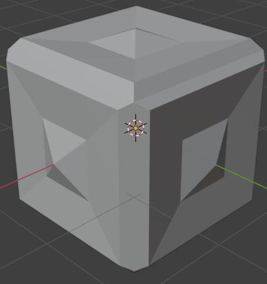

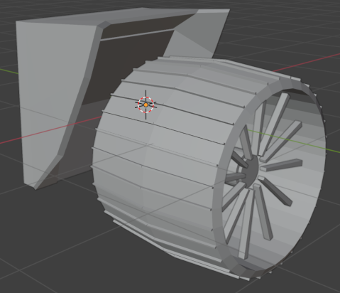

#### Further Development of Vehicle Building and Additional Features

At this point in time, we had a simplified version of input control implemented, where the player assumed a free-moving perspective controlled by WASD, and the car was controlled using Q/E to steer and the car went forward automatically. (This is a description of the design and implementation process, we have improved the controls from here).

Later, we implemented a more polished version of the initial system, by adding color-indicated blocks for the various parts of the car, as well as imported some additional assets, establishing a centralized control panel block for the player to build off of. At this point, we also utilized Unity’s new input system to integrate a more user-friendly input experience. We also began working on developing additional features such as turrets for eventually when an established gameplay loop is developed. So far, we have implemented drive mode and build mode along with four components to experiment with: hull, drive wheels, turn wheels and turrets.

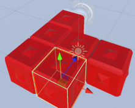

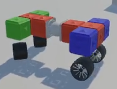

In build mode, the player can move in the xy-plane using WASD or the arrow keys. The player can also hover up or down using space for up and shift for down. These are similar to the Minecraft creative mode controls.

Additionally, the player can left click to place the currently selected block and right click to delete. The selected block type is displayed in a textbox in the top left of the screen. Currently the white text does not show up well on light backgrounds, so we hope to make it more visible in the next update. The player can cycle through available block types using the scroll wheel.

The four block types available in this update are:

- Hull - This is the most basic block and simply acts as a structural piece to build out your vehicle. It is red.
- Turn wheel - This block is a special variant of the hull block which has a wheel prefab attached to it. This wheel is configured to respond to the player's input during drive mode to turn left and right. It is green.
- Drive wheel - This is very similar to the turn wheel but the wheel prefab is configured to respond to forward and backwards input. It is blue to differentiate it from the drive wheel.
- Turret - This block only has one connection point on the bottom. Turrets can still be placed on the top, bottom or side of blocks. It fires when the player fires unless the line of sight is blocked by another component.

In drive mode, the player can accelerate either forwards or backwards using W/S. The player can turn any turn wheels using A/D. Additionally, the player can fire using left click.

Building was implemented by using a raycast from the camera until a block is hit. Then, the normal of the collision is computed and a new block is instantiated at an integer offset from that location. Additionally, a fixed joint component is added between the new and old block. During build mode, all blocks are marked as kinematic. However, the player can press “b” to toggle build mode and transition into drive mode. When this occurs, the block manager iterates through each block and enables the physics causing the car to fall. When build mode is entered again, the physics are turned off and the car levitates back up to a build height allowing the player to access all angles of the vehicle.

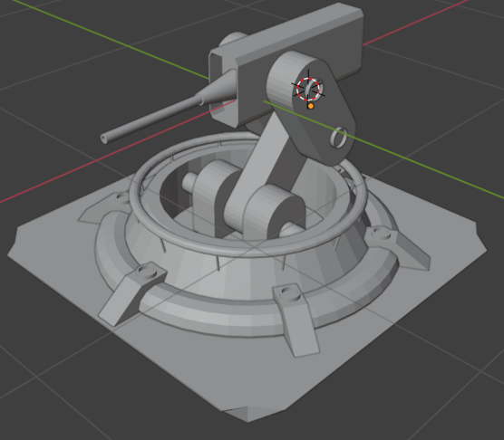

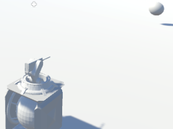

A first iteration model for the turret is modelled up and rigged in Blender. Model is imported to Unity to use with the Animation Rigging package to allow Unity to use inverse kinetics to calculate how the turret should behave when the aiming location changes. In this version, the turret follows a target location decided by a raycast from the camera. If there are obstacles along the way, e.g. other blocks, the turrets will emit a line rendered by a line renderer as a visual cue that it is blocked and won’t shoot. 

An early-stage procedural world generation was also created utilizing an icosahedron-mesh that has size and sub-division flexibility. A new physics system was developed to allow for planet-centric gravity rather than Unity’s default Rigidbody logic.

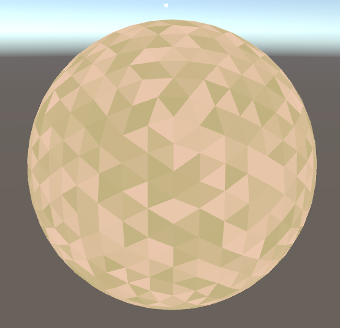

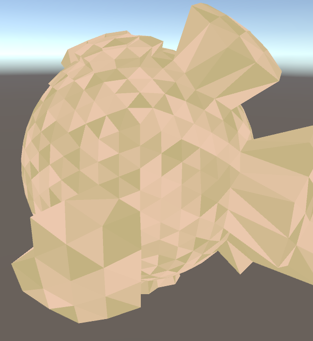

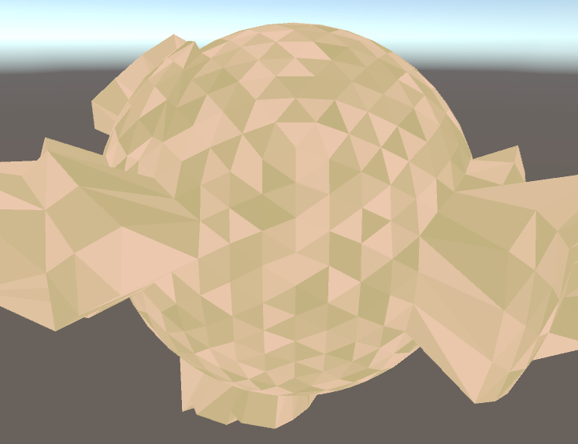

As per the comments made for the last submission, we have started working on this submission with the intention of it being a proof of concept for the vehicle building system. We only started adding in features after having a MVP for the building mechanic and physics simulation, just as we are told to do. As for the advice of not integrating assets into the the game and to use proxies when starting, we started by using proxies in the prototyping stage, as shown in the first picture of this segment. However, we switched to using actual assets once we have gone past that stage, the justification being that the effort of replacing proxies with actual assets might outweigh the effort we could save by not doing it. We also thought that it would be a good idea to start making some assets as a way to visually prototype what the game would look like once developed, and work on the art direction along the way. The last justification would be that the assets we are currently using are all fairly simple, and some of the elements (e.g. base plate aka. the connector of blocks) could be and need to be reused in future assets to ensure standardization, so it would be beneficial to make it as early as possible. As for the procedual generation of the world, we are currently working on it as a way to explore whether the option would be feasible, and we will either use it or drop it in the future. 

### Project Part 2:
We transitioned from the base testing scenes into a more developed and fleshed-out scenery which would better represent our vision for the final product. Working with the terrain tools, we created a mountainous woodland terrain. We utilized the ProBuilder tool in unity to add on a couple of additional structures. A handful of assets were imported, including trees, rocks, and general woodland assets in addition to a custom nighttime sky for ambiance. Many of our assets were designed for the Build-In shading system contrary to our URP system, and so many of the materials had to be custom made with appropriate shading and details. Lighting systems were also experimented with, adding custom directional light as well as fog settings to both mask details to allow for computational efficiency as well as add to the visual appeal of the game.

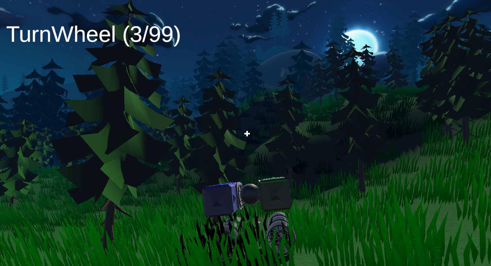

#### Assets:

[Render Knight - Fantasy Skybox](https://assetstore.unity.com/packages/2d/textures-materials/sky/fantasy-skybox-free-18353)

[Polytope Studio - Lowpoly Environment](https://assetstore.unity.com/packages/3d/environments/lowpoly-environment-nature-free-medieval-fantasy-series-187052)

Wanting to develop our weapons systems further and improve upon the fundamentals taught in the textbook, we work with both Visual Effects and Shading crafts (and the associated scripting) in order to add some VFX for the turrets. An initial particle system was created for the base turret, adding a small explosion / muzzle flash to enhance the look and feel of the shooting systems. Another more advanced particle system we are working to implement is for the energy turret, to get a highly stylized laser which requires some external art/modeling softwares (primitive version shown below).

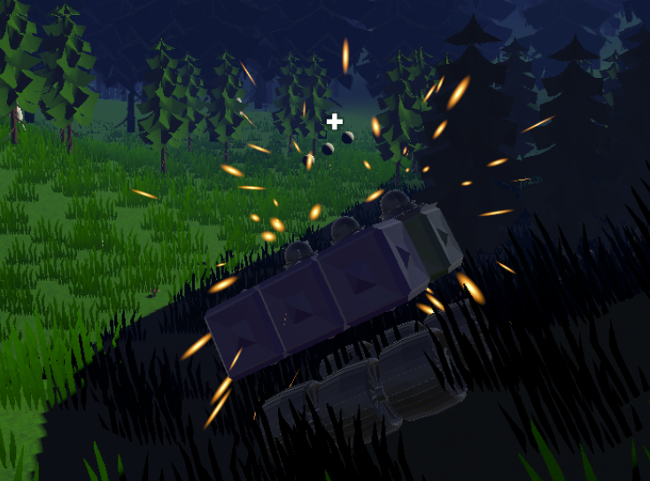

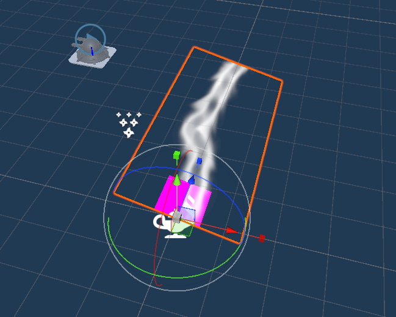

AI:

As outlined above, we have implemented the first iteration of the enemy AI system and have tuned it to a point where it feels good for now. The AI will use the same block structure as the player and behave similarly. We still need to tune the AI to make it fun and fresh to fight every time.

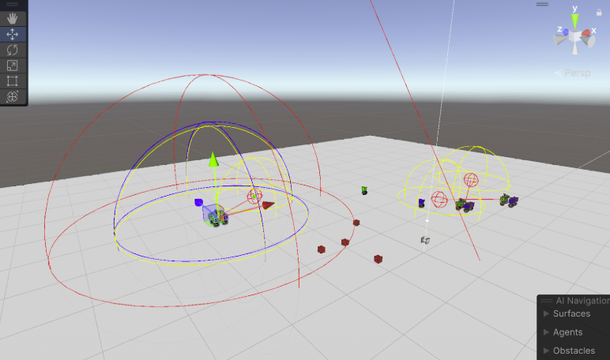

Shader and post effects:
For a stylized almost cartoonish look, we have implemented a shader graph for a toon effect and a post processing pass for an outline effect. The result looks something like the following. For now, the main issue is the aliasing we have seen with the outline effect, which we might need to solve somehow down the road.

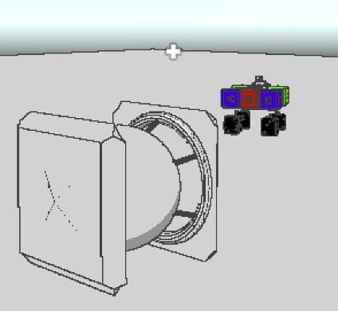

### Project Part 3

We implemented a more refined UI, following the cartoonish-style of the game by adding in 8-bit textures for the blocks as well as changing the default text. The menu can be opened by pressing TAB while in build mode. This allows the player to scroll through all available blocks. There is a recycle button to convert blocks to scraps and a build button to convert scraps to blocks. There is also an icon depicting how many scraps you currently have available. In the future, we hope to add an additional text box displaying how many blocks of a certain type are available.

In addition, we worked on a minimap to give the player additional information about the surrounding area. The minimap tracks the command module’s translation using an orthographic projection. It is always displayed in the lower right corner and displays the vehicle and the landscape. It is always oriented north and does not rotate as the vehicle rotates allowing the player to orient themselves when needed.

#### UI and gameplay refinement

UI is a main focus of this checkpoint. The original UI looks horrid and makes us not want to work on the project when we see it. So we did an overhaul of it. 

First step is making a background image for the panels, which we did in Aseprite and imported into Unity.

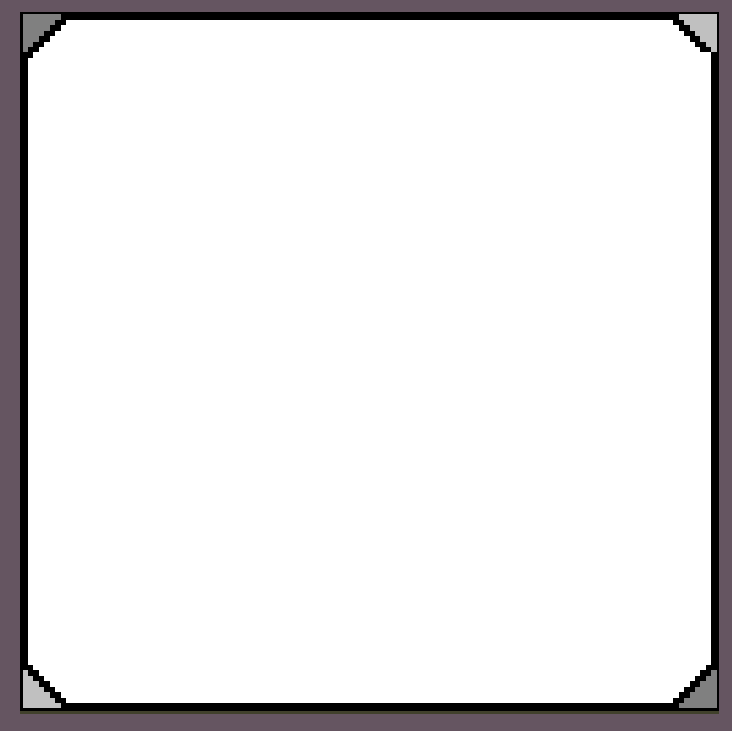

This will be the foundation of the UI work we do at this moment, as we could resize and reuse this in panels.

Then, we came up with the following static mockup of the crafting UI.

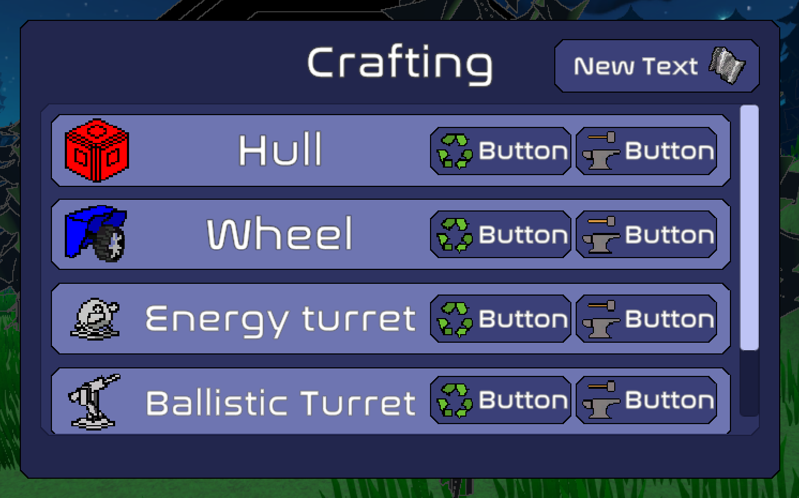

The color palette choice is questionable but we did dig the kind of retro style and the NASA-esque choice of font. So we went with it. 

By creating a prefab for each UI entry and some short scripting and uses a vertical layout group, we managed the implement the UI (with a few issues, of course, what is game dev without the shenanigans?) 

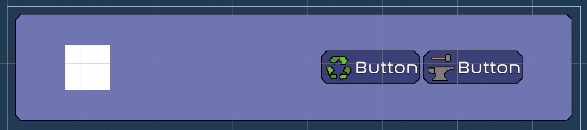

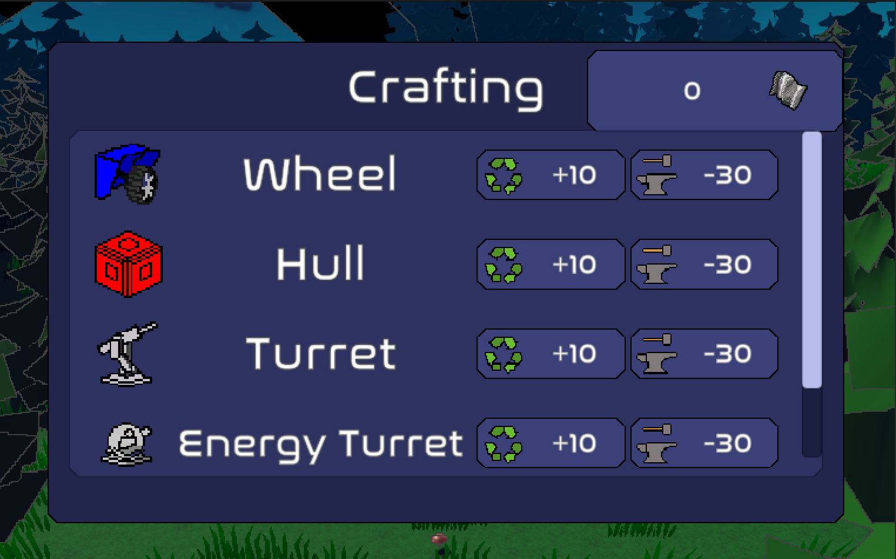

The background not displaying is a known issue and is under investigation, also the weird looking panel on top right.

As we talked about before, the reason we started with the crafting menu is that this menu is also important in a gameplay perspective, as it finishes the last piece of the gameplay loop: when the player takes off blocks from dead enemies, they will probably have a lot of blocks they don’t need and the rarer blocks will remain hard to find, so the players can scrap some unused blocks to craft some more needed ones, thus closing the shoot-loot-craft-build game loop.

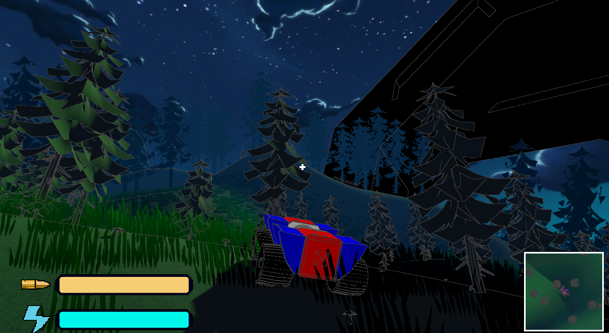

(This version of the minimap is bugged, have since fixed this issue)

In addition to all of the previous updates, we also added a minimap as pictured in the bottom right. This uses a two-camera system and uses an orthographic projection in order to achieve the pictured look. We had an artifact in which the shading for the player and the trees were not aligned with their physical object, and so the toon shader had to be slightly tweaked.

We also added a tracker for ballistic and energy ammo, the current idea is that energy ammo will replenish when out of battle and ballistic ammo needs to be crafted with scraps.

### Project Part 4

### Polishing Gameplay Loop and Mechanics

We managed to iron out some very major bugs that were blockers to getting a lot of things done. Mainly the issue that happens when building the vehicle on a slope. Before it didn’t work because the vehicle is not properly aligned to the grid, more specifically the local coordinate grid relevant to the parent. Before the hierarchy change the parent that all blocks refer to was the command module, which moved along with the vehicle so that no matter the initial alignment the building system worked. However, after the hierarchy change (for people unfamiliar with that it was when we made it so that all blocks share a single parent that is just an empty game object), since the local coordinates as relative to the new parent is not reliable anymore, we had to rewrite the entire building system around the new hierarchy. Now, we keep another reference transform that share the position and rotation of the command module, and when we go into build mode we transfer all blocks to under the new reference transform, effectively zeroing out the local position and rotations, then we could rotate the new reference object to identity rotation and transfer all blocks back to the old block parent.

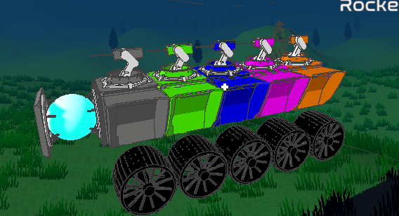

We also added five different rarities to the game: common (gray), uncommon (green), rare (blue), epic (purple) and legendary (orange). So far, only the hull, wheel and turret blocks have different rarities. We plan to continue tweaking the stats of each rarity to feel distinct without feeling overpowered. Most importantly, the different block rarities have different physics properties which affects how large of a vehicle you can build. We also plan to have certain advanced blocks only available in higher rarities. Primarily the shield generator and rocket boosters will be rarer items. Having different block rarities allows us to create AI vehicles of varying strengths which will make the enemy progression much more interesting and dynamic.

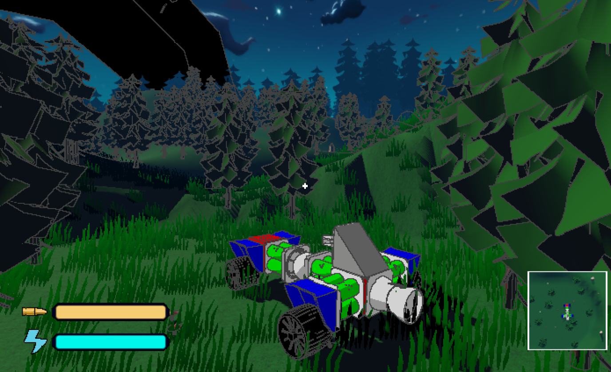

We have also added more blocks to the game, namely the rocket booster, battery and half block. The rocket booster brings a new method of moving around for the player and complements the driving gameplay really well. Batteries are good for fleshing out the shooting gameplay, and half blocks are good for times where looks matter. Overall after creating an workflow for adding new blocks it become a lot easier to do so, and we would probably add more for next milestone. 

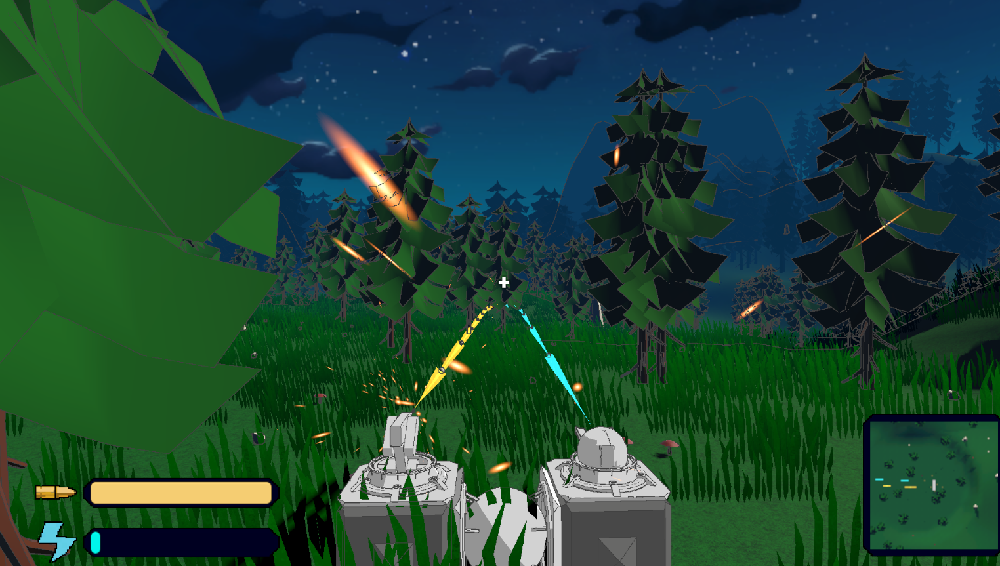

Another thing we did is that we added a lot of "juice" to the game. One thing would be the addition of bullet trails, which makes battles a lot more visually cool, combined with the "jitter" effect of blocks when hit and the sparks partical effect when hit, fighting feels a lot more rewarding and "juicy" now. Last but not least, to fully use the potential of bullet trails, we made it so that ballistic bullets that hit a enemy shield would be deflected instead of just absorbed, and it looked really cool.

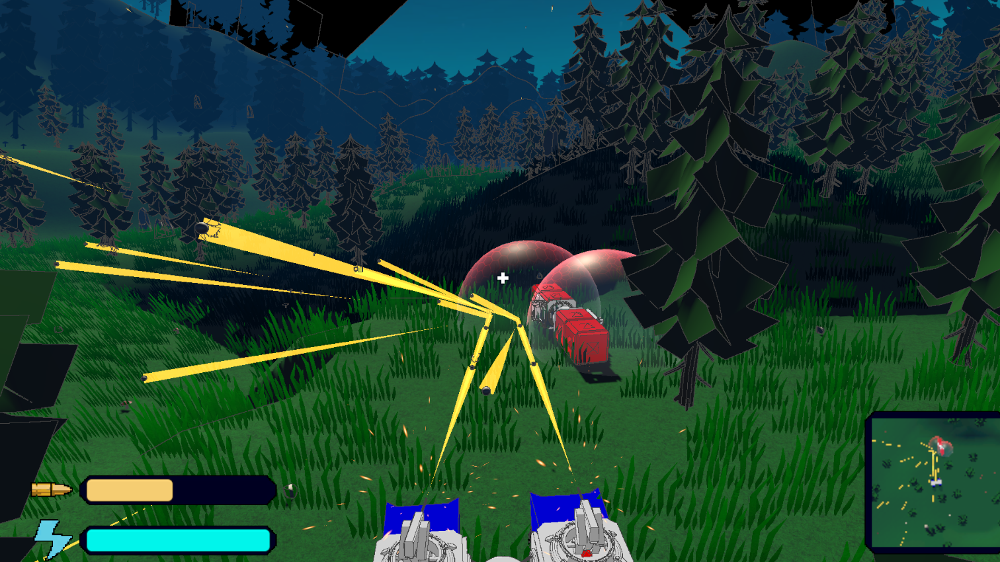

Another things would be that we have implemented a much bigger map into the game, it is currently still a bit empty, so we will be adding more POIs to it. We did fix the issue where the tree billboards are much larger than the models themselves, which is cool. We are also working on a script that would allow trees to fell when hit, which would be interesting.

Last but not least, we added a script for converting player vehicle to AI vehicles in the editor. Before we have to go through a long and convoluted process of creating AI vehicles, which is annoying and prone to errors. Now we can just make the vehicle in the game, apply the script to the block parent, and store the vehicle as a prefab.  

### Project Part 5

As we promised before, we did a lot of polishing for the gameplay loop and the player experiences in general. One major thing we implemented is a win condition, which in this case is that the player would need to have **an avionics nose cone, a battery and a rocket booster** on their vehicle, which would mean that they have all the parts needed to leave the planet, and in the gameplay sense finish the game. To get the crafting recipe for the avionics, the player would need to beat a boss for the first level, which is current undesigned (waiting for design from team) and unnamed (we have a rudimentary design that doesn't use the new level based block system). We also implemented respawning so that when the player dies it would be respawned at the starting platform.

We also implemented a lot of UI elements for the new mechanics. Namely we added a checklist for build mode for all blocks needed to win the game, it would be created dynamically and managed dynamically, so no hard coding needed which is good for scaling into more levels. We also added a dark souls style health bar for the boss fight, which is fully functional and looks cool.

We have also fleshed out the AI converter script and have fixed a lot of bugs in the previous implementation, it should be fully functioning correctly and should make the workflow of creating AI enemies a lot easier.

Another thing we did for this patch would be that we added some sound effects to the game, namely a ambiance sound track, sound effects for the two types of cannons, and a rocket take off sound effect for the win game screen.

As an update to block rarities, the force required to break a joint now scales with rarity. We added a section to the build script which accesses the block stats for the break force. Then it adds both the break force of the new block and the block it is connecting to in order to set the final strength. This allows different block rarity combinations to respond differently to physics collisions which adds another layer of strategy and realism.

Additionally, another small bug fix was updating bullet physics. In previous versions, the bullet moved in a straight line at a fixed speed no matter when it was fired. In this version, the bullet now calculates a new velocity for itself based on the relative world space velocity of the turret it was fired from. This makes combat much more exciting and higher paced when driving at increased speeds. In previous versions, the bullets would move very slowly relative to the turret which fired it leading to self collisions that were not desirable.

### Instructions for Testing the Project
_Instructions for Base Game_

Load into the ~~Terrain~~ Mission Ingenuity 2 scene.

In the ~~Terrain~~ Mission Ingenuity 2 scene, after launching the scene you will see a floating Command Module block which serves as the central point for the vehicle build. At this point you will be in “Build Mode”. The controls follow a basic first person WASD control scheme with the mouse to move your perspective. Space and shift can be used to fly up and down respectively. You will additionally see a basic UI in the upper left hand side, indicating the current selected block as well as the amount available of that type. To cycle through the different block types, you can use the scroll wheel.

You can access the menu by pressing TAB while in build mode. You can click the green recycle button or the hammer build button to convert any block into 10 scraps or 30 scraps into any block (for now). Beware! The conversions are lossy!

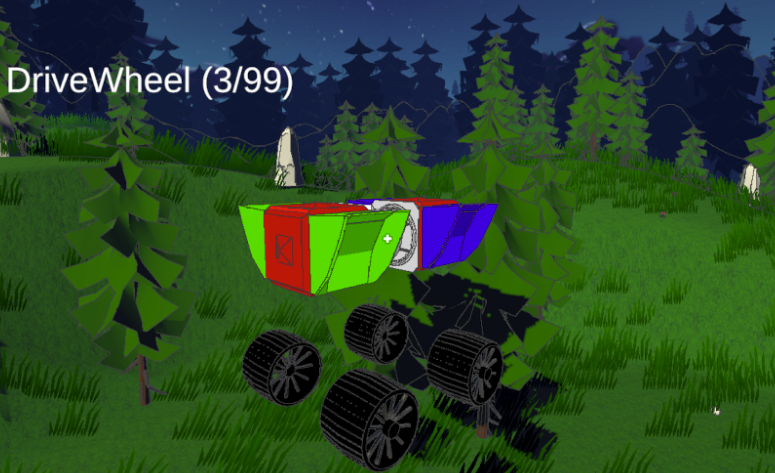

Once you’ve built a vehicle that you are satisfied with, you can press “B”. This will shift from “Build Mode” to “Play Mode”. The POV will then shift to a vehicle-centric third person view. Here, WASD can be used to control the vehicle, and the mouse will be used to rotate around the vehicle and also used for aiming. If you have selected a turret build, left mouse click will be used for shooting.

_Instructions for Arena Gamemode CURRENTLY UNSUPPORTED IN CHECKPOINT 3_

~~Load into the Arena scene.~~

~~Overall the controls are similar to what they are in the main game mode. The only difference is that the player is not allowed to manually switch between build and drive mode, instead the player must fight off a wave of enemies in drive mode before being switched back to build mode.~~

~~When launching the game, you will be put into build mode, where you need to build up a vehicle that you would use to beat the enemies. Once ready, you could press Enter and go into battle. A certain number of enemies will be spawned around you and in the same control scheme as above you need to defeat them, once done you will be put back into build mode automatically. Once back into build mode, you can pick up the reward blocks that spawned around using right mouse click while aiming at it. There will be a timer for you to upgrade the vehicle and once the timer runs out you will be spawned into battle again. You can also press Enter again to skip the timer.~~

Currently arena mode is not updated up to date with new UI, since combat is not part of the focus for checkpoint 3 (whatever number for april 2nd)

### Known bugs
~~- When some noncore block on AI vehicle gets destroys, the strucural validation calculation is faulty, causing the AI to fall apart.~~

- Crafting UI entries missing background
- Tree breaking doesn't have particle effect
- Trees are sometimes off the ground

### Assets
- https://assetstore.unity.com/packages/2d/textures-materials/sky/fantasy-skybox-free-18353
- https://assetstore.unity.com/packages/3d/environments/lowpoly-environment-nature-free-medieval-fantasy-series-187052
- https://assetstore.unity.com/packages/essentials/ui-samples-25468
- https://assetstore.unity.com/packages/audio/sound-fx/sci-fi-guns-sfx-pack-181144

### Play Test Video
[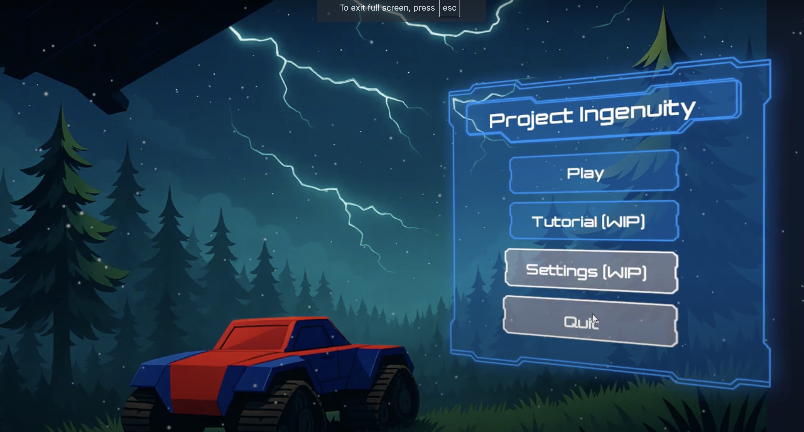](https://www.youtube.com/watch?v=Z0fQY1dj6ME&ab_channel=JayKim)

### Future work

We plan on expanding the game after the presentation. Aspects we could expand on include

- More worlds, flesh out existing world with more POI and bosses (current idea include a bot factory that constantly spawn enemies and need to be destroyed by shooting out batteries, and a boss that has rockets and physical weapons strapped on and attacks by ramming you)
- More blocks, improve and work upon the rarity system, armor stat for projectile and blocks (can have special armored blocks that can deflect shots if the projectile's armor penetration is lower, at the cost of being heavier and more expensive)
- More weapons, physics based weapon, e.g. a wrecking ball, a drill etc.
- Better building and block size standardization. Now the block sizes are all over the place and there is no representation for if a block would need to take up a 2 * 2 * 2 instead of 1 * 1 * 1. Reworking the models might also be necessary.
- Better UI and handling. Some playtesters have said that the building, especially the handling for selecting blocks feels unintuitive, so we might need to rework the build mode completely. Current ideas include having the vehicle stay the middle of the screen and unlocking the cursor and allowing the player to build by clicking and select blocks in a inventory type system. 


