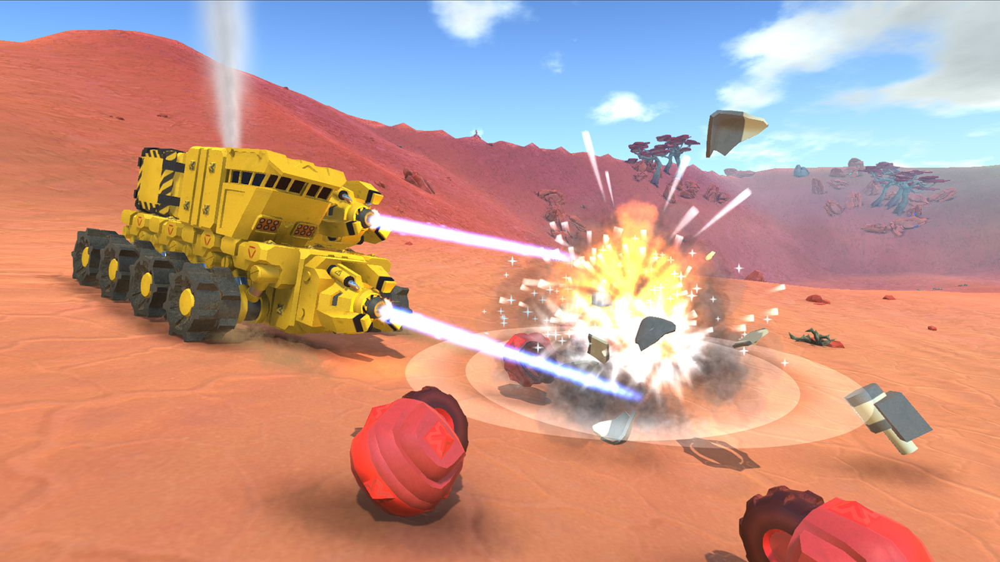

# Mission Ingenuity

- **Jiaming Shen**, Github ID: [JohnnieShen](https://github.com/JohnnieShen)
- **Liam Baca**, Github ID: [Racecar13](https://github.com/Racecar13)
- **Jay Kim**, Github ID: [jaykim2022](https://github.com/jaykim2022)

## Game Summary

You are a command module of a defunct rover and you found yourself powering on in the middle of nowhere on an alien planet with no parts attached to you. You need to scavenge for parts scattered around and upgrade your rover, fight hostile enemies of various kinds and build a rocket that will get you out of here to continue your quest for exploration.

## Genres

This game will be a TPS game with characteristics taken from rogue-lite games. It will also feature a handcrafted openworld that allows the player to explore freely, but the overall game structure will still be linear.
Inspiration

## Inspiration games

**TerraTech**


"TerraTech is an open-world, sandbox adventure game, where you design and build your own creations through a mix of crafting, combat and discovery. Design vehicles from a huge library of blocks. Scavenge, craft and buy new parts to survive and become the ultimate planetary prospector."

We plan to take inspiration from the general gameplay loop of TerraTech, where the player is able to explore an open-ish world and scavenge for new building blocks of their vehicle. However, we plan on having “levels” instead of a big open world so that the project is going to scale a bit better and we could add more mechanics and elements into different levels. We also plan on adding more engaging gameplay other than exploration, for example roguelike mechanics.

**Slay the Spire**

“Slay the Spire is a game in which you climb The Spire, ascending its floors through three acts, encountering many enemies, bosses, and events along the way. The paths through each act all lead to a final floor where a challenging boss encounter awaits. The content of each floor and the available paths through each act are procedurally-generated, so each run will be a different experience.”

We aim to incorporate the roguelite deck-building aspect of Slay the Spire into our game. Rather than having “cards” that players can pick up, our game will offer different parts, weapons, and general customization to the player’s car which can enhance the current build. An overarching goal would be to develop a diverse skill tree in which players can build up their vehicles depending on an archetype they want to follow, with some added randomization. 

## Gameplay

Players will explore an alien planet from a third-person perspective, controlling a modular rover that evolves as they collect new parts. Interaction and game loop will be driven by scavenging, combat, and various upgrades, encouraging experimentation with different builds. 

A customization inventory system will allow players to part swap on the fly, which rewards creativity, while an in-game map provides navigation assistance. 

Control-wise, the game will feature control schemes similar to other arcade-style vehicle driving/third-person shooter games such as *Robocraft*.

## Development Plan

### Project Checkpoint 1-2: Basic Mechanics and Scripting (Ch 5-9)

Sketch out a rough idea of what parts of your game you will implement for the next submission, Project Checkpoint 1-2: Basic Mechanics and Scripting involving Unity textbook Chapters 5 through 9. You will come back to update this for each submission based on which things you've accomplished and which need to be prioritized next. This will help you practice thinking ahead as well as reflecting on the progress you've made throughout the semester.

Our initial goal will be to implement basic car and tire physics mechanics into our game. One approach to this is treating cars as a single rigid body attached to 4 additional rigid bodies which represent the wheels. The forces will be acting on the wheels, and consist of three major components:

1. **Suspension**  
   - Based on classical spring mechanics, with an added damping force to account for an infinite oscillation.  
   - A basic calculation would be:  
     ```math
     Force = (Offset × Strength) - (Velocity × Damping)
     ```

2. **Acceleration**  
   - Depends on the amount of applied torque.  
   - Depending on the current direction of steering, different acceleration limits will be hit.  
   - A basic implementation is to set a top speed value, and then based on the applied torque, follow a semi-Gaussian distribution for situational acceleration limits.

3. **Steering**  
   - Two different components to velocity:
     - The direction the tires are facing.
     - The direction perpendicular to that.
   - Steering arises from that perpendicular direction, and in order to provide a sense of traction/steering, a counteracting opposite velocity is needed.  
   - Depending on the magnitude of this opposite velocity, the amount of sliding will be adjusted.

A higher-reaching goal will be to work on a basic implementation for the car-building mechanic. 

Possibly adding in some “parts” that can be added onto the car and a simple UI selection screen for those parts.